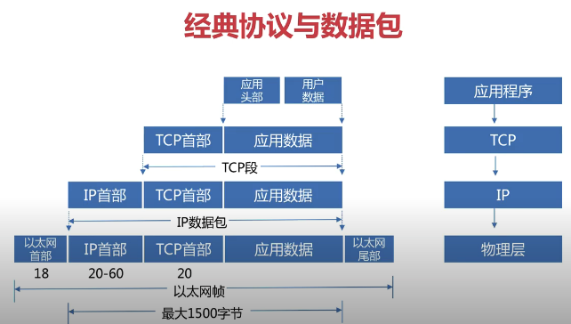
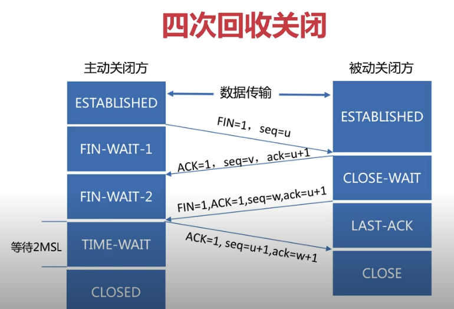
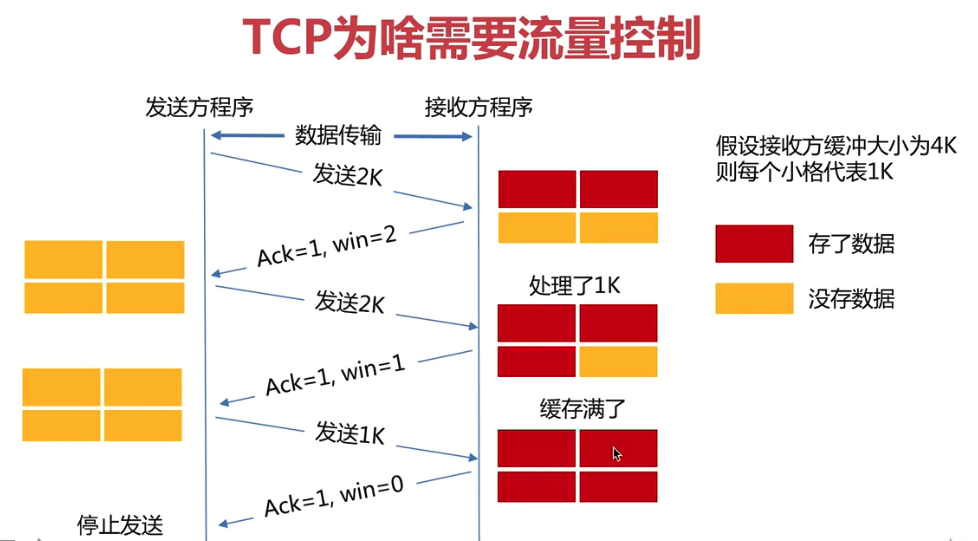

# 第2章 扫盲网关前置技术：必备网络基础
https://www.youtube.com/playlist?list=PLygayBQ8jAaJNBjHaqF6WGiau3suO_8R5


## 2-1 为什么要学习网络基础【有目的学习，事半功倍】 (04:03)

## 2-2 经典协议与数据包 (04:10)



## 2-3 tcpdump抓包分析三次握手和四次挥手 (06:02)
```
  tcpdump -n -S -i eth0 host www.baidu.com and tcp port 80
```

## 2-4 为啥time_wait需要等待2msl (04:28)

MSL: Maximum Segment Lifetime 30s to 1m

保证TCP全双工连接可以可靠关闭

保证本次连接的重复数据段从网络消失

## 2-5 图解为啥需要流量控制 (03:04)


## 2-6 如何调整网络负载 (04:09)

## 2-7 解开粘包、拆包谜团 (04:12)
数据大于套接字缓冲区
接收不及时
MSS < TCP 报文

使用带长度信息的报文

## 2-8 自定义消息格式实现装包与拆包 (05:46)

## 2-9 udp实现原来如此简单 (03:44)

## 2-10 玩转tcp服务器 (04:03)

## 2-11 忘记关闭连接会怎么样 (04:59)

## 2-12 http Server与 Client【常用必学!!! 】 (05:46)

## 2-13 脑图精讲http Server源码 (11:46)

## 2-14 脑图精讲http Client源码 (04:05)

## 2-15 RoundTripper连接上下游的纽带 (08:59)

## 2-16 超详情的http超时控制 (02:49)

## 2-17 网络基础章节总结 (00:47)

