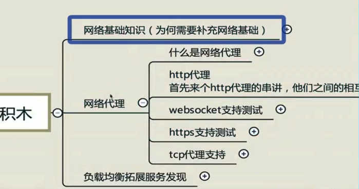
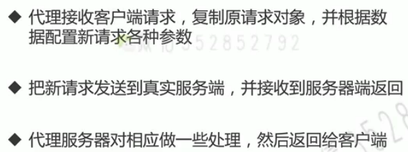
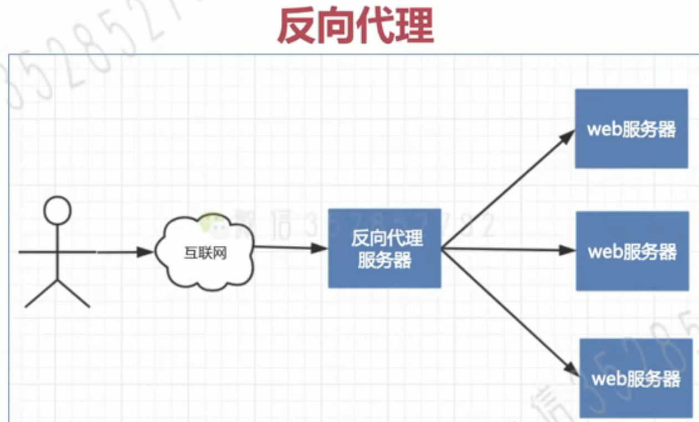

# 第4章 网络代理之HTTP代理*基础篇

## 4-1 纵观全貌 - 脑图展示网关代理知识体系 (04:06)

## 4-2 刨根问底 - 代理和转发不是一回事 (02:55)

## 4-3 开发一个浏览器代理1 (04:08)

demo/proxy/forward_proxy

## 4-4 开发一个浏览器代理2 (05:43)

## 4-5 反向代理原来如此 (08:13)

demo/proxy/reverse_proxy

## 4-6 http代理知识脉络 (03:02)

## 4-7 神兵利器 - ReverseProxy无坚不摧 (05:03)

## 4-8 返回内容随心改1 (08:23)

## 4-9 返回内容随心改2 (07:13)

## 4-10 ReverseProxy特殊Header-Connection.mp4 (09:53)

## 4-11 温故知新 - 带你实现X-Forward-For、X-Real-Ip (10:07)

## 4-12 一针见血 - 脑图精讲 ReverseProxy源码分析 (16:20)

## 4-13 随机负载均衡 (04:58)

## 4-14 轮询负载均衡 (02:11)

## 4-15 加权轮询负载均衡 (09:50)

## 4-16 一致性负载均衡 (10:18)

## 4-17 给代理插上负载均衡的翅膀 (09:51)
